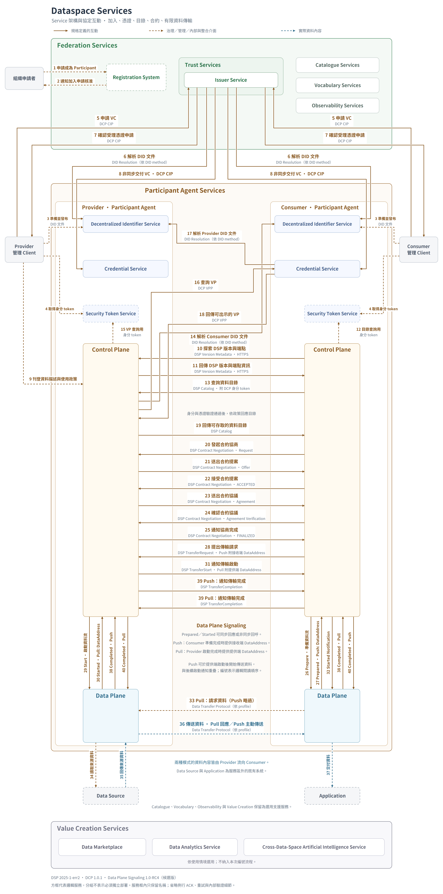

# data-space

本專案以 service 架構圖說明 Dataspace 從參與者加入、憑證申請與交付，到目錄查詢、合約協商及有限資料傳輸的互動。服務分為 Federation Services、Participant Agent Services 與 Value Creation Services；Provider 在左、Consumer 在右。

## 架構圖

[](docs/images/dataspace-architecture.png)

點選圖片可開啟完整解析度。[HTML／可編輯 SVG 原稿](docs/images/dataspace-services.html) 支援水平捲動。服務框內只保留名稱，動作、編號、協定及模式條件直接標在連線上。

| 圖面標示 | 意義 |
|---|---|
| 棕色實線 | DSP、DCP、Data Plane Signaling 定義的互動，以及依 DID method 進行的邏輯 DID Resolution。 |
| 棕色虛線 | 加入治理、管理操作、STS 內部 API，以及未指定的資料請求／來源整合介面。 |
| 藍色虛線 | 實際資料內容；來源、資料平面與應用間的整合或傳輸協定依實作／profile 決定。 |
| 虛線框 | Registration System、雙方 STS、Data Source 與 Application，其治理、內部或整合邊界未由圖列協定規定。 |

編號表示邏輯閱讀順序，相同操作在雙方及 Pull／Push 分支可共用編號。圖中服務為邏輯分工，不要求各自獨立部署。Catalogue、Vocabulary、Observability 與 Value Creation 保留為選用支援服務，沒有強制串入流程。

本圖採 Consumer 直接查詢 Provider 的受保護目錄，以 DCP 驗證身分及所需資格，再依政策回應。憑證申請受理不代表已完成簽發，VC 由 Issuer Service 非同步交付至 Credential Service。DCP 也可用於後續 DSP 互動；詳細時序見 [DCP 身分、憑證與流程說明](docs/dcp-overview.md)。

Pull 與 Push 都由 Consumer 提出 DSP 傳輸請求，資料內容都由 Provider 流向 Consumer。Pull 由消費端請求資料；Push 由提供端主動傳送。**Push 在提供端資料流啟動後即可傳送，可能與後續啟動通知重疊。** Prepared／Started 可同步回應或非同步回呼。圖面呈現有限資料傳輸的成功流程，省略例行 ACK、重試、錯誤分支與服務內部驗證。[Data Plane Signaling：互動流程](https://github.com/eclipse-dataplane-signaling/dataplane-signaling/blob/v1.0-RC4/specifications/signaling.md)

## 服務分工

| 服務區 | 元件與用途 |
|---|---|
| Federation Services | Registration System 處理加入申請與治理；Trust Services 群組中的 Issuer Service 簽發及管理 VC。Catalogue Services 支援目錄聚合與發現，Vocabulary Services 支援共用語意，Observability Services 支援交換紀錄與追溯。 |
| Participant Agent Services | 雙方各有 Security Token Service、Credential Service、Decentralized Identifier Service、Control Plane 與 Data Plane，分別負責身分 token、VC／VP、DID 文件、協定與政策協調，以及資料流控制與傳輸。 |
| Value Creation Services | 保留 Data Marketplace、Data Analytics Service 與 Cross-Data-Space Artificial Intelligence Service，依使用情境選用。 |

組織申請者放在 Registration System 左側，兩個管理 Client 放在各自 Participant Agent 外側。Data Source 與 Application 是既有外部系統，保留在各自 Data Plane 下方。Marketplace 的選用不構成加入流程的必要入口。服務分類參考 [DSSC Blueprint](https://blueprint.dssc.eu/)，參與者及簽發端邏輯服務依 [DCP 系統模型](https://github.com/eclipse-dataspace-dcp/decentralized-claims-protocol/blob/v1.0.1/specifications/dataspace.ecosystem.md)。

## 規格基準

以下為本圖固定採用的版本，實作互通仍須確認共同採用的 binding、DID method 與 profile。

| 規格 | 版本 | 範圍 |
|---|---|---|
| [Dataspace Protocol（DSP）](https://github.com/eclipse-dataspace-protocol-base/DataspaceProtocol/tree/2025-1-err2/specifications) | 2025-1-err2 | 版本與端點探索、目錄、合約協商、傳輸流程訊息及狀態。 |
| [Decentralized Claims Protocol（DCP）](https://github.com/eclipse-dataspace-dcp/decentralized-claims-protocol/tree/v1.0.1/specifications) | 1.0.1 | 參與者身分 token、Credential Issuance Protocol（CIP）及 Verifiable Presentation Protocol（VPP）。 |
| [Data Plane Signaling](https://github.com/eclipse-dataplane-signaling/dataplane-signaling/blob/v1.0-RC4/specifications/signaling.md) | 1.0-RC4（候選版） | Control Plane 與 Data Plane 間的準備、啟動、完成及其他資料流控制。 |
| [DID Core](https://www.w3.org/TR/did-core/) | 1.0 | DID、DID 文件及邏輯解析；實際解析方式依 DID method。 |

DSP 未限定採用 DCP，也不定義實際資料傳輸協定。本圖選用 DCP 保護目錄互動，並以「Data Transfer Protocol（依 profile）」保留資料傳輸方式的選擇。[DSP 範圍](https://github.com/eclipse-dataspace-protocol-base/DataspaceProtocol/blob/2025-1-err2/specifications/common/scope.md)、[DCP 與 DSP 的關係](https://github.com/eclipse-dataspace-dcp/decentralized-claims-protocol/blob/v1.0.1/specifications/dataspace.ecosystem.md#interrelation-to-the-dataspace-protocol)

## 編輯與匯出圖片

修改 HTML 內的 SVG 後，以 Python 環境安裝 `CairoSVG==2.9.1`，並確保系統提供 libcairo 與 Noto Sans CJK TC 字型，再執行：

```bash
python docs/images/render_architecture.py
```

匯出工具直接讀取 HTML 內自含樣式的 SVG，以 2 倍解析度覆寫 README 使用的 PNG；不依賴網路字型。完成後須檢查箭頭端點、標籤與中文顯示。
