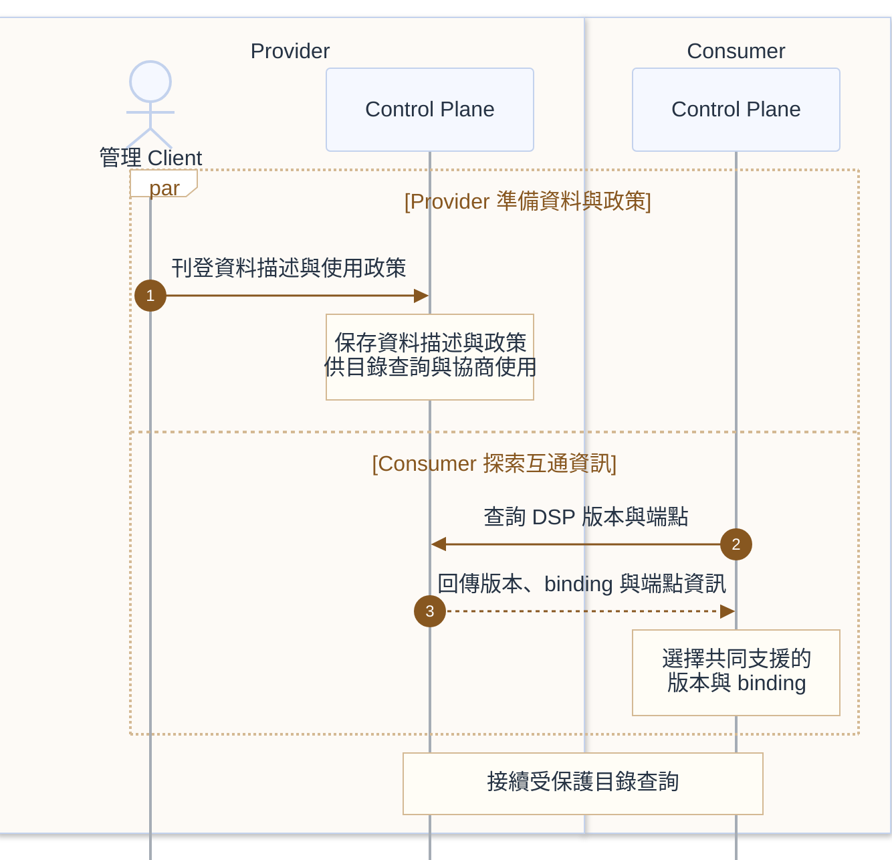
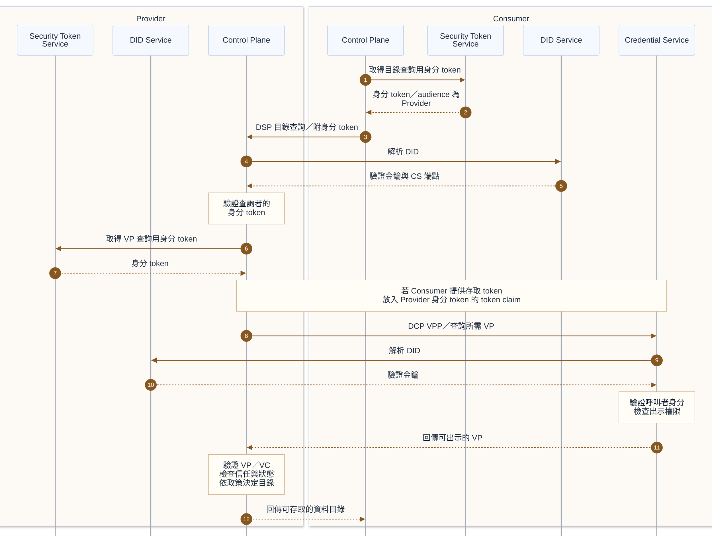

# 資料刊登與目錄存取

此流程由 Consumer 直接查詢 Provider 的受保護目錄。Provider 使用 DCP 驗證 Consumer 的身分與所需資格，再依目錄存取政策決定回傳內容。

## 前置條件

- Provider 已備妥資料描述與使用政策，管理 Client 可操作 Control Plane 的刊登介面。
- Consumer 已知 Provider 的版本探索入口；雙方具備共同支援的 DSP 版本、binding 與適用的 DCP profile。
- 受保護查詢前，雙方 DID 文件可解析、STS 可產生身分 token。Consumer 已取得政策所需的 VC，並由其 CS 保存；申請方式見[憑證申請與交付](credential-issuance.md)。
- Provider 已設定可接受的簽發者、信任規則與目錄存取政策。

## 參與服務

| 歸屬 | 角色／服務 | 分工 |
|---|---|---|
| Provider | 管理 Client、Control Plane | 刊登資料描述與政策，提供 DSP 版本資訊及目錄；驗證資格並評估政策。 |
| Provider | Security Token Service、DID Service | 產生 VP 查詢用身分 token，提供 Provider 的 DID 文件。 |
| Consumer | Control Plane、Security Token Service | 探索版本及端點，取得身分 token 並提出目錄查詢。 |
| Consumer | DID Service、Credential Service | 提供 DID 文件及 CS 端點；驗證 VP 查詢者後出示允許的 VP。 |

## 資料刊登與版本探索

刊登與探索可分別進行；Provider 須在回應目錄時備妥可用的描述與政策。刊登 API 依實作。DSP 版本探索採 HTTPS，端點以 `/.well-known/dspace-version` 結尾，**不要求身分驗證**；回應提供版本、binding 與端點等 metadata。無共同版本時不能接續 DSP 互動。[DSP 2025-1-err2 版本與端點探索](https://github.com/eclipse-dataspace-protocol-base/DataspaceProtocol/blob/2025-1-err2/specifications/common/common.protocol.md)

## 受保護目錄查詢

## 實作注意事項

- **Holder 與 Verifier**：Consumer 為 Holder，Provider 為 Verifier。Provider 查詢 Consumer 的 CS 時，使用 **Provider 簽署**的身分 token。若 Consumer 提供 VP 存取 token，Provider 須將它放入自身身分 token 的 `token` claim。CS 驗證查詢者身分及出示權限；CS 與 STS 之間的內部 API 依實作決定。[DCP VPP](https://github.com/eclipse-dataspace-dcp/decentralized-claims-protocol/blob/v1.0.1/specifications/verifiable.presentation.protocol.md)
- **資格與政策**：Provider 驗證 VP／VC 的來源、完整性、信任、有效性及適用狀態，再評估可存取的目錄。身分 token 不等於成員資格，取得 VP 也不代表已授予資料存取權。[DCP 信任模型](https://github.com/eclipse-dataspace-dcp/decentralized-claims-protocol/blob/v1.0.1/specifications/trust.model.md)
- **協定分工**：DSP 的身分與信任機制可搭配 DCP。此流程使用 DCP 保護目錄查詢，後續的合約協商與傳輸控制互動也可使用 DCP 驗證身分與資格。驗證可使用既有的有效 VC，無須每次重新簽發。[DCP 與 DSP 的關係](https://github.com/eclipse-dataspace-dcp/decentralized-claims-protocol/blob/v1.0.1/specifications/dataspace.ecosystem.md#interrelation-to-the-dataspace-protocol)
- **解析與支援服務**：DID Resolution 依 DID method 進行。此流程直接查詢 Provider 的目錄；Catalogue Services 可另外提供目錄聚合與發現功能。本文涵蓋成功查詢，拒絕、錯誤、重試與服務內部驗證不在本文範圍內。

## 相關連結

- 前一步：[憑證申請與交付](credential-issuance.md)
- 下一步：[合約協商](contract-negotiation.md)
- [DSP 目錄協定](https://github.com/eclipse-dataspace-protocol-base/DataspaceProtocol/blob/2025-1-err2/specifications/catalog/catalog.protocol.md)
- [README 架構圖](../README.md#架構圖)與[規格基準](../README.md#規格基準)
