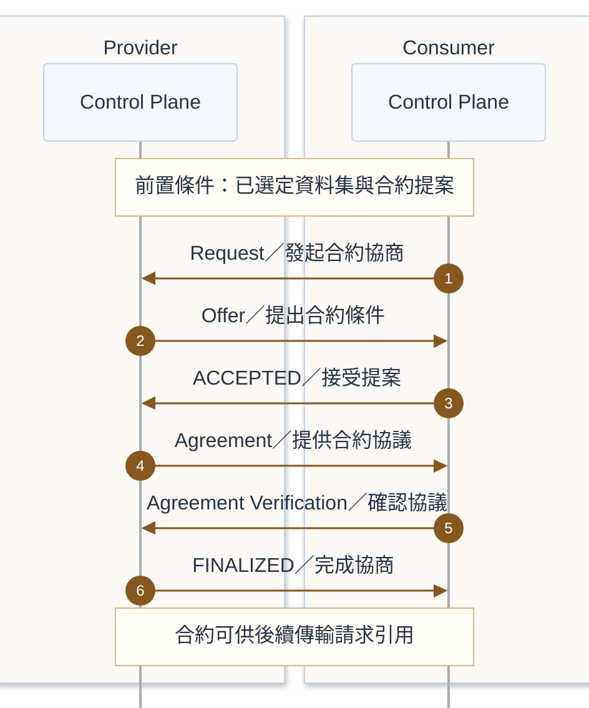

# 合約協商

本流程依 DSP 2025-1-err2，呈現 Consumer 選定資料集與提案後，雙方 Control Plane 從 Request 到 FINALIZED 的合約協商成功路徑。

## 前置條件

- Consumer 已完成[目錄查詢](catalog-access.md#受保護目錄查詢)，選定資料集與合約提案。
- 雙方已確認共同支援的 DSP 版本、binding、端點與身分驗證方式。
- 雙方 Control Plane 可評估提案與政策，並記錄協商狀態及合約識別資訊。

## 參與服務

| 歸屬 | 服務 | 分工 |
|---|---|---|
| Provider | Control Plane | 回應協商、提出條件、提供 Agreement，並通知 FINALIZED。 |
| Consumer | Control Plane | 發起協商、接受提案、驗證 Agreement，保留後續傳輸所需的合約資訊。 |

## 循序圖

## 實作注意事項

- **訊息名稱**：圖中的 Request、Offer、Agreement、Agreement Verification 分別對應 `ContractRequestMessage`、`ContractOfferMessage`、`ContractAgreementMessage`、`ContractAgreementVerificationMessage`；ACCEPTED 與 FINALIZED 是 `ContractNegotiationEventMessage` 的事件類型。ACCEPTED 由 Consumer 發出，FINALIZED 由 Provider 發出。
- **成功流程**：本文涵蓋一次提案即接受的協商流程。每次狀態轉移須依 DSP 完成訊息接收與確認（ACK）。其他協商路徑，以及往返提案、終止、錯誤與重試的處理，請參閱 [DSP 合約協商協定](https://github.com/eclipse-dataspace-protocol-base/DataspaceProtocol/blob/2025-1-err2/specifications/negotiation/contract.negotiation.protocol.md)。
- **身分與資格**：合約協商的 DSP 互動可使用 DCP 驗證身分與資格，驗證流程見「[受保護目錄查詢](catalog-access.md#受保護目錄查詢)」。資格驗證與合約條件評估是不同責任。[DCP 與 DSP 的關係](https://github.com/eclipse-dataspace-dcp/decentralized-claims-protocol/blob/v1.0.1/specifications/dataspace.ecosystem.md#interrelation-to-the-dataspace-protocol)
- **傳輸邊界**：合約完成後，Consumer 可在傳輸請求中引用 Agreement。合約協商本身不搬移資料；接續的 Pull／Push 均由 Consumer 發起 DSP TransferRequest，實際傳輸方式依約定的 profile。[DSP 傳輸流程](https://github.com/eclipse-dataspace-protocol-base/DataspaceProtocol/blob/2025-1-err2/specifications/transfer/transfer.process.protocol.md)

## 相關連結

- 前一步：[資料刊登與目錄存取](catalog-access.md)
- 下一步：[Pull 資料傳輸](transfer-pull.md)或[Push 資料傳輸](transfer-push.md)
- [README 架構圖](../README.md#架構圖)與[規格基準](../README.md#規格基準)
