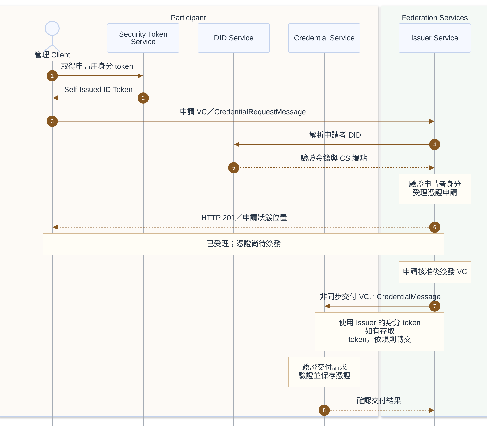

# 憑證申請與交付

本流程依 DCP 1.0.1 的 Credential Issuance Protocol（CIP），同時適用 Provider 與 Consumer。**申請受理不代表已完成簽發**；Issuer Service 在核准並簽發後，另行將 VC 非同步交付至申請者的 Credential Service。

## 前置條件

- 已完成適用的[加入治理與 DID 準備](participant-onboarding.md)，DID 文件可解析，並提供 Credential Service 的服務資訊。
- 管理 Client 已知 Issuer Service 端點、可申請的憑證種類與申請要求；Registration System 核准不能替代簽發端的資格審核。
- Security Token Service 可產生身分 token；Credential Service 可接收並保存 VC，相關信任與存取規則已設定。

## 參與服務

| 歸屬 | 角色／服務 | 分工 |
|---|---|---|
| Participant | 管理 Client | 取得申請用身分 token 並申請憑證。 |
| Participant | Security Token Service（STS） | 產生本參與者的 Self-Issued ID Token。 |
| Participant | DID Service（DIDS） | 提供申請者 DID 文件中的驗證金鑰及服務資訊。 |
| Participant | Credential Service（CS） | 驗證交付請求、接收並保存 VC。 |
| Federation Services／Trust Services | Issuer Service | 驗證及審核申請、簽發與交付 VC，管理憑證生命週期。 |

### 身分與憑證名詞

| 名稱 | 意義 |
|---|---|
| Self-Issued ID Token | 由參與者控制的金鑰簽署的身分 token；本身不等於第三方核發的成員資格。 |
| VC — Verifiable Credential | Issuer 簽發的可驗證憑證，承載資格等 claims。 |
| VP — Verifiable Presentation | Holder 向 Verifier 出示的可驗證呈現，可包含所需 VC。 |
| Issuer／Holder／Verifier | 分別為簽發者、持有者與驗證者；Holder／Verifier 由互動決定，不固定等同 Consumer／Provider。 |

以上身分、服務與信任分工依 [DCP 系統模型](https://github.com/eclipse-dataspace-dcp/decentralized-claims-protocol/blob/v1.0.1/specifications/dataspace.ecosystem.md)、[基礎協定](https://github.com/eclipse-dataspace-dcp/decentralized-claims-protocol/blob/v1.0.1/specifications/base.protocol.md)與[信任模型](https://github.com/eclipse-dataspace-dcp/decentralized-claims-protocol/blob/v1.0.1/specifications/trust.model.md)。

## 循序圖

## 實作注意事項

- **非同步交付**：Issuer Service 受理申請後回應 `HTTP 201`，並以 `Location` 提供申請狀態的查詢位置。申請核准且憑證完成簽發後，Issuer Service 另行傳送 `CredentialMessage` 至 CS，交付 VC。受理回應與憑證交付是兩次獨立互動。
- **交付身分與權限**：Issuer 使用其自身的 Self-Issued ID Token。若申請者原先提供存取 token，Issuer 必須將它放入交付用身分 token 的 `token` claim；CS 驗證身分及適用的存取權限後保存憑證。以上依 [DCP CIP](https://github.com/eclipse-dataspace-dcp/decentralized-claims-protocol/blob/v1.0.1/specifications/credential.issuance.protocol.md)。
- **內部與解析介面**：STS 的 token 取得 API 依實作決定。DID Resolution 依 DID method 進行，解析介面由所用方法決定。CS 負責交付請求的驗證、權限檢查與憑證保存；DCP 不規定 CS 與 STS 之間的固定內部 API。
- 憑證格式、驗證細節與互通要求依雙方共同採用的 [DCP profile](https://github.com/eclipse-dataspace-dcp/decentralized-claims-protocol/blob/v1.0.1/specifications/dcp.profiles.md)。本文涵蓋申請受理、核准後簽發與非同步交付；申請狀態輪詢、拒絕、重試、撤銷及金鑰輪替不在本文範圍內。

## 相關連結

- 前一步：[加入治理與 DID 準備](participant-onboarding.md)
- 下一步：[資料刊登與目錄存取](catalog-access.md)
- [README 架構圖](../README.md#架構圖)與[規格基準](../README.md#規格基準)
