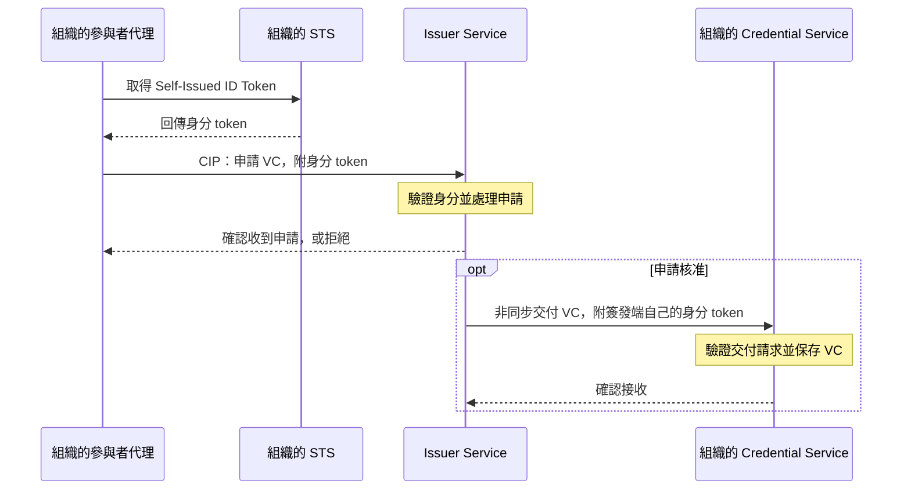
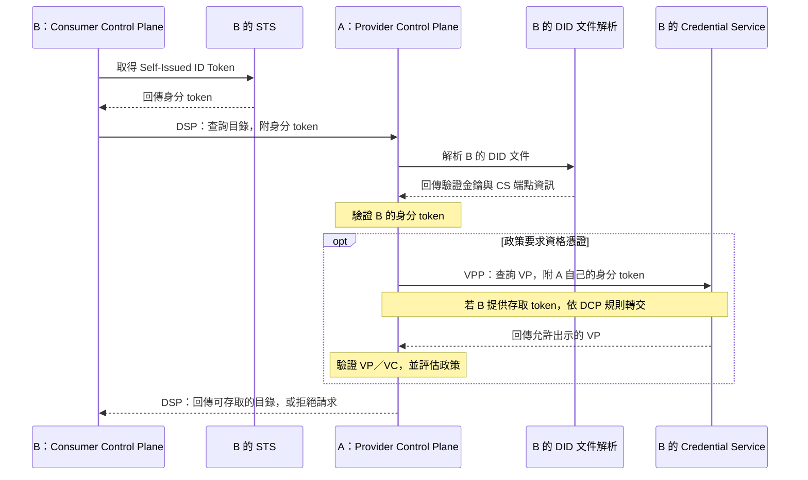

# DCP 身分、憑證與流程說明

## 用途與規格基準

本文件依 [Eclipse DCP v1.0.1](https://eclipse-dataspace-dcp.github.io/decentralized-claims-protocol/v1.0.1/) 說明身分、憑證與 [README 流程](../README.md#流程說明) 的關係，核對日期為 **2026-09-14**。README 的流程編號與元件名稱用於對照本專案架構；協定要求以官方版本規格為準。

DCP 讓參與者驗證互動對方的身分，並取得及驗證對方出示的資格證明。參與者代理再將驗證結果對照政策，決定是否允許目錄存取、合約協商或傳輸流程。

DSP 定義資料交換的目錄、協商及傳輸流程訊息；DCP 提供可搭配使用的身分與信任機制。DSP 本身不限定使用 DCP。[DCP 與 DSP 的關係](https://github.com/eclipse-dataspace-dcp/decentralized-claims-protocol/blob/v1.0.1/specifications/dataspace.ecosystem.md#interrelation-to-the-dataspace-protocol)、[信任模型](https://github.com/eclipse-dataspace-dcp/decentralized-claims-protocol/blob/v1.0.1/specifications/trust.model.md)

## 身分、憑證與服務角色

| 名稱 | 說明 |
|---|---|
| DID | DCP 要求使用的參與者識別碼；解析 DID 文件可取得驗證金鑰與相關服務資訊。 |
| Self-Issued ID Token | 參與者使用自己控制的金鑰簽署的身分 token，用來驗證參與者身分；本身不等於第三方核發的成員資格。 |
| VC — Verifiable Credential | 由 Issuer 簽發、可驗證來源與完整性的憑證，承載成員資格等 claims。 |
| VP — Verifiable Presentation | 持有者向驗證者出示的可驗證呈現，可包含所需的 VC。 |
| Issuer／Holder／Verifier | 分別為憑證簽發者、持有者與驗證者；Holder／Verifier 依互動決定，不能固定等同資料 Consumer／Provider。 |
| STS — Security Token Service | 產生本參與者的 Self-Issued ID Token；內部 API 與部署方式屬實作選擇。 |
| CS — Credential Service | 保存參與者持有的 VC，處理憑證交付及 VP 查詢。 |
| DIDS — DID Service | 管理與發布 DID 文件。 |
| Issuer Service | 由 Credential Issuer 運作的服務，負責 VC 簽發與生命週期管理。 |

README 的 Identity Service 是身分功能的統稱。DCP 描述 STS、CS、DIDS 等邏輯服務，沒有要求它們合併成單一服務或分別部署。[基礎概念](https://github.com/eclipse-dataspace-dcp/decentralized-claims-protocol/blob/v1.0.1/specifications/base.protocol.md)、[術語](https://github.com/eclipse-dataspace-dcp/decentralized-claims-protocol/blob/v1.0.1/specifications/terminology.md)、[系統模型](https://github.com/eclipse-dataspace-dcp/decentralized-claims-protocol/blob/v1.0.1/specifications/dataspace.ecosystem.md#systems)

## 兩種核心互動

### ③ 憑證申請與簽發

1. 組織的代理取得自己的身分 token，透過 Credential Issuance Protocol（CIP）向 Issuer Service 申請 VC。
2. Issuer Service 驗證申請者身分，並處理資格審查；審查可包含自動或人工流程。
3. 申請核准後，Issuer Service 非同步將 VC 交付至持有者的 Credential Service。
4. Credential Service 驗證交付請求並保存 VC，供後續出示。收到申請的確認回應，不代表 VC 已完成簽發。

下圖為簡化示意，省略部分驗證與錯誤處理細節。

流程依據：[DCP Credential Issuance Protocol](https://github.com/eclipse-dataspace-dcp/decentralized-claims-protocol/blob/v1.0.1/specifications/credential.issuance.protocol.md)。

### ⑦ 目錄查詢時的身分與憑證驗證

1. B 的 Control Plane 取得 B 的身分 token，隨 DSP 目錄請求送給 A。
2. A 解析 B 的 DID 文件，驗證 token，並取得 B 的 Credential Service 端點。
3. 若政策要求資格證明，A 透過 Verifiable Presentation Protocol（VPP）向 B 的 Credential Service 查詢 VP。
4. Credential Service 檢查 A 的查詢權限，回傳允許出示的 VP。
5. A 驗證 VP 與其中的 VC，包括相關簽章、有效性及適用的撤銷狀態，再依政策決定回應內容或拒絕存取。

下圖為簡化示意。查詢 VP 時，A 使用自己簽署的身分 token；若 B 提供存取 token，A 將它放入自己的身分 token 中，依 DCP 規則轉交給 B 的 Credential Service。

VPP 的憑證查詢是驗證端向持有者的 Credential Service 發出的互動。這個模式也適用於其他需要身分與資格驗證的 DSP 訊息交換，並非只用於目錄查詢。[DCP Verifiable Presentation Protocol](https://github.com/eclipse-dataspace-dcp/decentralized-claims-protocol/blob/v1.0.1/specifications/verifiable.presentation.protocol.md)、[信任模型](https://github.com/eclipse-dataspace-dcp/decentralized-claims-protocol/blob/v1.0.1/specifications/trust.model.md)

## 對應 README 流程

| 步驟 | DCP 的用途與邊界 |
|---|---|
| ①② | 加入審查、核准與成員登錄由治理流程處理，DCP 未定義這些業務流程。 |
| ③ | CIP 處理 VC 申請、簽發及交付。 |
| ④⑥⑫ | 刊登、搜尋及查詢交換紀錄的 Portal API 不由 DCP 定義；後端若觸發其他協定互動，依該互動判斷 DCP 的使用。 |
| ⑤ | Federated Catalog 若以參與者代理身分存取受保護目錄，使用 DCP 驗證身分及所需資格；目錄訊息使用 DSP。 |
| ⑦ | 目錄查詢使用 DSP，身分 token 與所需 VP／VC 的驗證使用 DCP。 |
| ⑧ | 協商訊息使用 DSP，DCP 支援身分及所需資格驗證。 |
| ⑨⑩ | 雙方 Control Plane 交換 DSP 傳輸流程訊息時涉及身分與資格驗證；Control Plane ↔ Data Plane 的控制介面使用 Data Plane Signaling。 |
| ⑪ | 實際資料透過雙方約定的傳輸協定交換；DCP 不替代資料端點的存取授權。 |

上表是將官方互動模型對應到本專案架構，不是 DCP 規定的固定步驟。資格驗證可隨互動發生，不能推論每一步都必須重新簽發或取得憑證。[DCP 系統範圍](https://github.com/eclipse-dataspace-dcp/decentralized-claims-protocol/blob/v1.0.1/specifications/dataspace.ecosystem.md#systems)、[DCP 信任模型](https://github.com/eclipse-dataspace-dcp/decentralized-claims-protocol/blob/v1.0.1/specifications/trust.model.md)、[DSP 傳輸流程範圍](https://github.com/eclipse-dataspace-protocol-base/DataspaceProtocol/blob/2025-1-err2/specifications/transfer/transfer.process.protocol.md)、[Data Plane Signaling](https://github.com/eclipse-dataplane-signaling/dataplane-signaling/blob/v1.0-RC4/specifications/signaling.md)

## 治理、信任與版本注意事項

Participant & Trust Registry 是 README 的治理服務分組。DCP 的 Verifiable Data Registry 提供 DID 等識別資訊與憑證 schema；兩者不能直接視為同義名稱。DCP 未規定成員登錄流程及受信任簽發者清單如何提供，也允許多個 trust anchors 與 Issuer Services。[術語](https://github.com/eclipse-dataspace-dcp/decentralized-claims-protocol/blob/v1.0.1/specifications/terminology.md)、[信任關係](https://github.com/eclipse-dataspace-dcp/decentralized-claims-protocol/blob/v1.0.1/specifications/trust.model.md#trust-relationships)

DCP v1.0.1 定義 `vc20-bssl/jwt` 與 `vc11-sl2021/jwt` 兩種 profile，分別使用 VC 2.0 與 VC 1.1。出現 VC 1.1 並不足以判定使用舊版 DCP；實際互通須確認採用的 profile。本文件不替專案選定 profile。[DCP Profiles](https://github.com/eclipse-dataspace-dcp/decentralized-claims-protocol/blob/v1.0.1/specifications/dcp.profiles.md)
