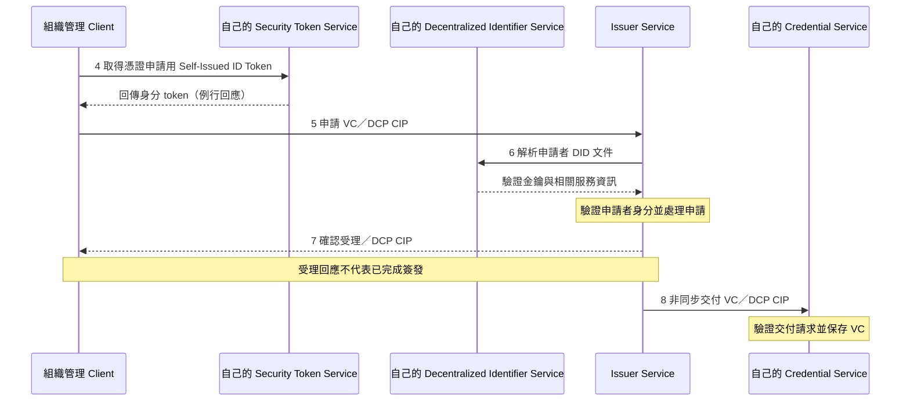
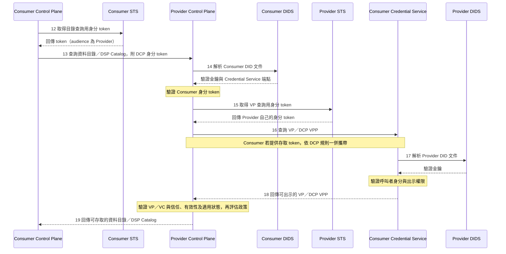

# DCP 身分、憑證與流程說明

## 用途與規格基準

本文件依 [Eclipse DCP 1.0.1](https://github.com/eclipse-dataspace-dcp/decentralized-claims-protocol/tree/v1.0.1/specifications) 說明身分、憑證與 [README 架構圖](../README.md#架構圖) 的關係。下文使用架構圖的 1–40 編號與 service 名稱，協定要求以連結的固定版本規格為準。

DCP 讓參與者驗證互動對方的身分，並取得及驗證對方出示的資格證明。Control Plane 再將驗證結果對照政策，決定允許的目錄內容或後續互動。DSP 定義目錄、合約協商及傳輸流程訊息，本身不限定使用 DCP；本架構選用 DCP 保護直接目錄查詢。[DCP 與 DSP 的關係](https://github.com/eclipse-dataspace-dcp/decentralized-claims-protocol/blob/v1.0.1/specifications/dataspace.ecosystem.md#interrelation-to-the-dataspace-protocol)、[信任模型](https://github.com/eclipse-dataspace-dcp/decentralized-claims-protocol/blob/v1.0.1/specifications/trust.model.md)

## 身分、憑證與服務角色

| 名稱 | 說明 |
|---|---|
| DID | 參與者識別碼；解析 DID 文件可取得驗證金鑰與相關服務資訊。 |
| Self-Issued ID Token | 參與者使用自己控制的金鑰簽署的身分 token；本身不等於第三方核發的成員資格。 |
| VC — Verifiable Credential | Issuer 簽發、可驗證來源與完整性的憑證，承載資格等 claims。 |
| VP — Verifiable Presentation | 持有者向驗證者出示的可驗證呈現，可包含所需的 VC。 |
| Issuer／Holder／Verifier | 憑證簽發者、持有者與驗證者；Holder／Verifier 依互動決定，不能固定等同 Consumer／Provider。 |
| Security Token Service（STS） | 產生本參與者的 Self-Issued ID Token；內部 API 不在 DCP 規範範圍內。 |
| Credential Service（CS） | 保存持有的 VC，處理憑證交付及 VP 查詢。 |
| Decentralized Identifier Service（DIDS） | 管理與發布 DID 文件。管理 API 與 DID 解析方法須分別看待。 |
| Issuer Service | 負責 VC 簽發及生命週期管理；圖中位於 Trust Services 群組內。 |

架構圖分別呈現 STS、CS 與 DIDS。這些是邏輯服務，不構成合併或分開部署的要求。DID Resolution 的抽象互動不表示固定 HTTP 端點，實際解析依 DID method。[DCP 系統模型](https://github.com/eclipse-dataspace-dcp/decentralized-claims-protocol/blob/v1.0.1/specifications/dataspace.ecosystem.md#systems)、[DCP 基礎協定](https://github.com/eclipse-dataspace-dcp/decentralized-claims-protocol/blob/v1.0.1/specifications/base.protocol.md)、[DID Core](https://www.w3.org/TR/did-core/)

## 憑證申請與交付

架構圖的加入申請與核准（1、2）由 Registration System 處理，屬治理流程。管理 Client 在自己的 DIDS 準備並發布 DID 文件（3），也可沿用已可用的 DID。以下 4–8 同時適用 Provider 與 Consumer，雙方共用編號。

Issuer Service 的受理回應為 HTTP 201；VC 交付是後續非同步互動。簽發端交付時使用自己的 Self-Issued ID Token；Credential Service 驗證交付請求及憑證後保存。架構圖省略例行回應與內部驗證細節。[DCP Credential Issuance Protocol](https://github.com/eclipse-dataspace-dcp/decentralized-claims-protocol/blob/v1.0.1/specifications/credential.issuance.protocol.md)

## 受保護目錄查詢的身分與憑證驗證

Provider 先由管理 Client 刊登資料描述與使用政策（9）。Consumer 探索 Provider 的 DSP 版本與端點，Provider 回傳相應 metadata（10、11）；這個 HTTPS 版本探索端點不要求身分驗證。接著才進行圖中受 DCP 保護的目錄查詢。[DSP Version Metadata](https://github.com/eclipse-dataspace-protocol-base/DataspaceProtocol/blob/2025-1-err2/specifications/common/common.protocol.md)

此時 Consumer 是憑證持有者，Provider 是驗證者。Provider 向 Consumer 的 Credential Service 查詢 VP，使用 **Provider 自己**的 Self-Issued ID Token；Consumer 若提供 VP 存取 token，Provider 將它放入自己的身分 token 的 `token` claim，依 DCP 規則轉交。Credential Service 內部的權限驗證不另畫成固定的 CS → STS API。[DCP Verifiable Presentation Protocol](https://github.com/eclipse-dataspace-dcp/decentralized-claims-protocol/blob/v1.0.1/specifications/verifiable.presentation.protocol.md)、[DCP 信任模型](https://github.com/eclipse-dataspace-dcp/decentralized-claims-protocol/blob/v1.0.1/specifications/trust.model.md)

## 後續互動與規格邊界

合約協商（20–25）採 Request、Offer、ACCEPTED、Agreement、Agreement Verification、FINALIZED 的成功路徑。後續 DSP 傳輸流程由 Consumer 提出 TransferRequest，Provider 以 TransferStart 通知啟動，有限資料傳輸以 TransferCompletion 收尾。這些 DSP 互動也可涉及 DCP 驗證；資格驗證不代表每一步都要重新簽發或取得憑證。[DSP 合約協商](https://github.com/eclipse-dataspace-protocol-base/DataspaceProtocol/blob/2025-1-err2/specifications/negotiation/contract.negotiation.protocol.md)、[DSP 傳輸流程](https://github.com/eclipse-dataspace-protocol-base/DataspaceProtocol/blob/2025-1-err2/specifications/transfer/transfer.process.protocol.md)

Control Plane 與本地 Data Plane 的 Prepare、Start、Started Notification 及完成互動使用 Data Plane Signaling。Push 的接收端 DataAddress 由 Consumer 準備後提供，Pull 的提供端 DataAddress 由 Provider 啟動後提供。Prepared／Started 可同步回應或非同步回呼；Push 資料傳送可能先於 Consumer 收到 Started Notification。圖中的有限傳輸完成通知依模式標示不同發起端，編號不是強制的全域阻塞順序。[Data Plane Signaling 1.0-RC4](https://github.com/eclipse-dataplane-signaling/dataplane-signaling/blob/v1.0-RC4/specifications/signaling.md)

實際資料交換及 Data Source／Application 整合使用約定的傳輸協定與介面；DCP 不替代資料端點的存取授權。圖中保留 DID method、DCP profile 與資料傳輸 profile 的選擇，不將它們固定為特定技術。[DSP 範圍](https://github.com/eclipse-dataspace-protocol-base/DataspaceProtocol/blob/2025-1-err2/specifications/common/scope.md)、[DCP Profiles](https://github.com/eclipse-dataspace-dcp/decentralized-claims-protocol/blob/v1.0.1/specifications/dcp.profiles.md)

Registration System 的加入治理、管理 Client 的操作介面，以及信任設定的供應方式不由 DCP 固定。Trust Services 是圖中的服務群組，Issuer Service 是實際簽發服務；DCP 允許多個信任錨點與簽發服務。Catalogue、Vocabulary、Observability 與 Value Creation 為選用支援，不構成本圖必要的 DCP 路徑。[DCP 系統模型](https://github.com/eclipse-dataspace-dcp/decentralized-claims-protocol/blob/v1.0.1/specifications/dataspace.ecosystem.md)、[DCP 信任關係](https://github.com/eclipse-dataspace-dcp/decentralized-claims-protocol/blob/v1.0.1/specifications/trust.model.md#trust-relationships)
