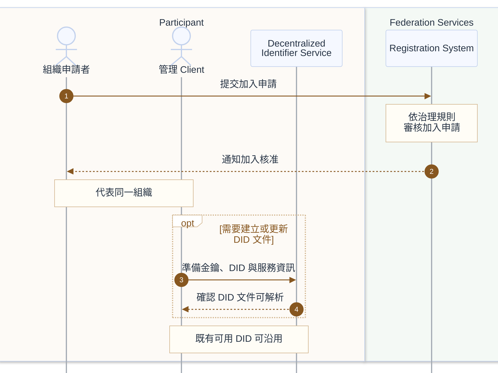

# 加入治理與 DID 準備

本流程同時適用 Provider 與 Consumer；圖中的 Participant 代表正在加入的組織。加入治理與 DID 準備屬於不同分工，圖示採先核准、再確認 DID 可用的閱讀順序。

## 前置條件

- 組織已知加入規則、申請入口及所需資料。
- 組織已指派申請者與管理 Client 的操作人員，並選定適用的 DID method。
- 既有 DID 可沿用；需新增或更新時，組織能管理金鑰與發布 DID 文件。

## 參與服務

| 歸屬 | 角色／服務 | 分工 |
|---|---|---|
| Participant | 組織申請者、管理 Client | 代表同一組織，分別提交加入申請與準備身分資訊。 |
| Participant | Decentralized Identifier Service（DIDS） | 管理與發布 DID 文件，使驗證金鑰與相關服務資訊可解析。 |
| Federation Services | Registration System | 依治理規則審核申請、通知加入核准。 |

## 循序圖

## 必要分支與規格邊界

- **既有 DID**：已有可解析且符合需求的 DID 時，可略過建立或更新文件的分支。治理規則也可要求申請前先準備 DID；圖中的先後不是 DCP 的強制規定。
- **治理與簽發**：加入核准不代表 VC 已簽發。需要憑證時，接續[憑證申請與交付](credential-issuance.md)。Registration System 的流程、管理 API 與信任設定的供應方式不由 DCP 固定。
- **DID 解析**：DID 是參與者識別碼；DID 文件提供驗證方法與服務資訊。圖中的發布確認及後續流程的 DID Resolution 都依 DID method 實現，不表示固定 HTTP 端點。DIDS 與其他服務是邏輯分工，不要求獨立部署。[DID Core 1.0](https://www.w3.org/TR/2022/REC-did-core-20220719/)、[DCP 1.0.1 系統模型](https://github.com/eclipse-dataspace-dcp/decentralized-claims-protocol/blob/v1.0.1/specifications/dataspace.ecosystem.md)
- 圖中只展開加入成功與 DID 準備的必要分支；審核拒絕、重試與金鑰生命週期管理不另增圖。

## 相關連結

- 下一步：[憑證申請與交付](credential-issuance.md)
- [README 架構圖](../README.md#架構圖)與[規格基準](../README.md#規格基準)
- [DCP 信任模型](https://github.com/eclipse-dataspace-dcp/decentralized-claims-protocol/blob/v1.0.1/specifications/trust.model.md)
