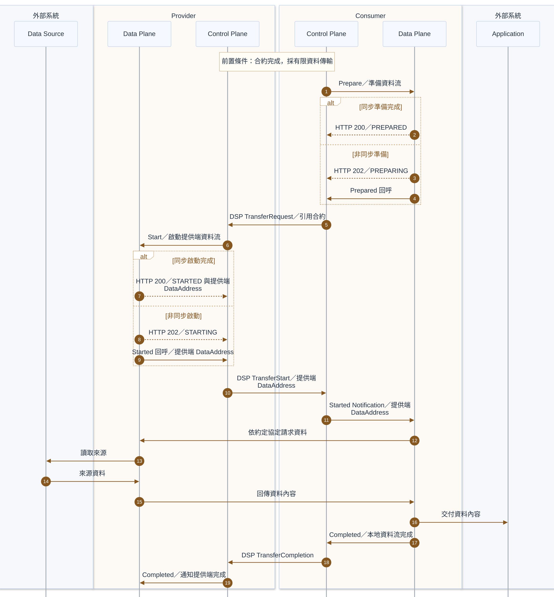

# Pull 資料傳輸

Consumer 提出 DSP 傳輸請求，取得 Provider 的 DataAddress 後，由 Consumer Data Plane 依約定協定請求資料。資料內容沿 Data Source → Provider Data Plane → Consumer Data Plane → Application 流動，有限傳輸由 Consumer 通知完成。

## 前置條件

- [合約協商](contract-negotiation.md)已完成，Consumer 可在傳輸請求中引用合約。
- 雙方已約定 Pull 傳輸 profile、實際資料傳輸協定與端點存取授權方式。
- 雙方 Control Plane 與 Data Plane 可使用 Data Plane Signaling 1.0-RC4；如採非同步 Prepare／Start，回呼端點可用。
- Provider 可讀取 Data Source，Consumer 可交付至 Application；本次資料具有明確結尾，採有限傳輸。

## 參與服務

| 歸屬 | 服務／系統 | 分工 |
|---|---|---|
| 外部系統 | Data Source | 提供來源資料。 |
| Provider | Data Plane、Control Plane | 啟動提供端資料流、產生並傳遞 DataAddress，回應資料請求。 |
| Consumer | Control Plane、Data Plane | 準備資料流、提出傳輸請求、取得資料並通知完成。 |
| 外部系統 | Application | 接收 Consumer 交付的資料內容。 |

## 循序圖

## 實作注意事項

- **同步／回呼**：Prepare 完成可同步回應 `HTTP 200／PREPARED`；尚在準備時回應 `HTTP 202／PREPARING`，完成後呼叫 Prepared。Start 同理使用 `HTTP 200／STARTED`，或 `HTTP 202／STARTING` 後呼叫 Started。202 只表示進行中，不能作為已完成啟動的通知。
- **DataAddress**：Pull 使用 Provider Data Plane 啟動後提供的地址，由 Provider Control Plane 經 DSP TransferStart 交給 Consumer，再透過 Started Notification 傳入 Consumer Data Plane。地址包含資料端點資訊，也可能包含授權資訊；DCP 身分驗證不替代資料端點授權。
- **完成方向**：在此有限 Pull 流程中，Consumer Data Plane 先以 Completed 通知本地 Control Plane，再由 Consumer Control Plane 傳送 DSP TransferCompletion 至 Provider，最後由 Provider Control Plane 通知其 Data Plane 完成。此順序適用於本文的有限 Pull 流程；其他傳輸模式須依對應規格處理。[Data Plane Signaling 1.0-RC4](https://github.com/eclipse-dataplane-signaling/dataplane-signaling/blob/v1.0-RC4/specifications/signaling.md)
- **協定分工**：`TransferRequestMessage`、`TransferStartMessage` 與 `TransferCompletionMessage` 是雙方 Control Plane 之間的 DSP 訊息。Prepare、Start、Prepared、Started、Started Notification 與 Completed 是本地 Control Plane 與 Data Plane 之間的 Data Plane Signaling 互動。[DSP 傳輸流程](https://github.com/eclipse-dataspace-protocol-base/DataspaceProtocol/blob/2025-1-err2/specifications/transfer/transfer.process.protocol.md)
- **資料內容**：實際 wire protocol 與 Data Source／Application 整合依實作及 profile 決定；DSP 不定義實際資料傳輸協定。[DSP 範圍](https://github.com/eclipse-dataspace-protocol-base/DataspaceProtocol/blob/2025-1-err2/specifications/common/scope.md)
- **適用範圍**：本文涵蓋有限資料傳輸的成功流程；例行 ACK、內部驗證、錯誤處理、重試、暫停與終止不在本文範圍內。非有限傳輸不適用上述完成順序。

## 相關連結

- 前一步：[合約協商](contract-negotiation.md)
- 另一模式：[Push 資料傳輸](transfer-push.md)
- 身分與資格驗證：[受保護目錄查詢](catalog-access.md#受保護目錄查詢)
- [README 架構圖](../README.md#架構圖)與[規格基準](../README.md#規格基準)
