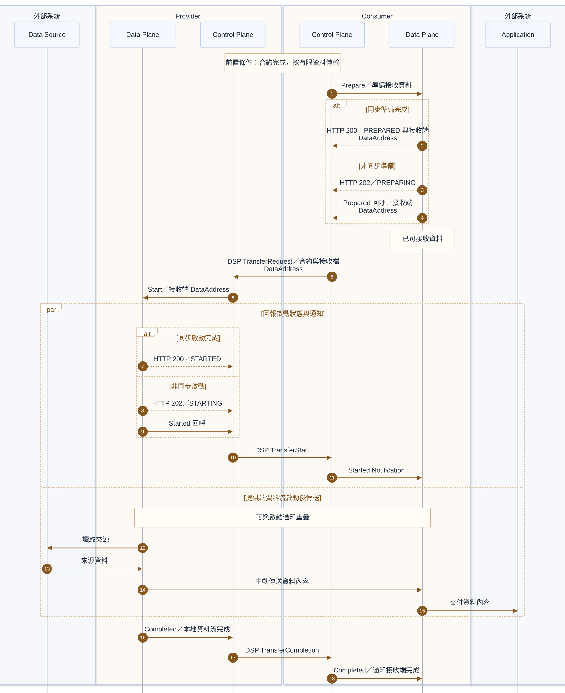

# Push 資料傳輸

Consumer 準備接收端 DataAddress 並提出 DSP 傳輸請求，Provider Data Plane 主動傳送資料。**Provider 的資料流啟動後即可傳送，可能與啟動狀態回報及後續通知重疊。** 資料內容沿 Data Source → Provider Data Plane → Consumer Data Plane → Application 流動，有限傳輸由 Provider 通知完成。

## 前置條件

- [合約協商](contract-negotiation.md)已完成，Consumer 可在傳輸請求中引用合約。
- 雙方已約定 Push 傳輸 profile、實際資料傳輸協定與端點存取授權方式。
- 雙方 Control Plane 與 Data Plane 可使用 Data Plane Signaling 1.0-RC4；如採非同步 Prepare／Start，回呼端點可用。
- Consumer 準備完成時已可接收資料；Provider 可讀取 Data Source，Consumer 可交付至 Application。本次資料具有明確結尾，採有限傳輸。

## 參與服務

| 歸屬 | 服務／系統 | 分工 |
|---|---|---|
| 外部系統 | Data Source | 提供來源資料。 |
| Provider | Data Plane、Control Plane | 依接收端 DataAddress 啟動並傳送資料，回報啟動及完成。 |
| Consumer | Control Plane、Data Plane | 準備接收端 DataAddress、提出傳輸請求並接收資料。 |
| 外部系統 | Application | 接收 Consumer 交付的資料內容。 |

## 循序圖

## 實作注意事項

- **同步／回呼**：Prepare 完成可同步回應 `HTTP 200／PREPARED` 與接收端 DataAddress；尚在準備時回應 `HTTP 202／PREPARING`，完成後透過 Prepared 回呼提供地址。Start 可同步回應 `HTTP 200／STARTED`，或先回應 `HTTP 202／STARTING`，完成後呼叫 Started。
- **DataAddress**：Push 的接收端地址由 Consumer Data Plane 在準備完成時提供；Consumer 在 DSP TransferRequest 中傳給 Provider，再由 Provider Control Plane 交給其 Data Plane。後續 Push 的 Started Notification 不再攜帶 DataAddress。
- **資料傳送時機**：Provider 的資料流啟動後即可傳送資料，傳送可與啟動狀態回報及後續通知並行。Consumer 應在準備完成時即可接收資料；Provider 無須等待 Consumer 收到 Started Notification 才開始傳送。Start 的 `HTTP 202` 回應僅表示啟動作業進行中，不能視為資料流已啟動。
- **完成方向**：在此有限 Push 流程中，Provider Data Plane 先以 Completed 通知本地 Control Plane，再由 Provider Control Plane 傳送 DSP TransferCompletion 至 Consumer，最後由 Consumer Control Plane 通知其 Data Plane 完成。此順序適用於本文的有限 Push 流程；其他傳輸模式須依對應規格處理。[Data Plane Signaling 1.0-RC4](https://github.com/eclipse-dataplane-signaling/dataplane-signaling/blob/v1.0-RC4/specifications/signaling.md)
- **協定分工**：`TransferRequestMessage`、`TransferStartMessage` 與 `TransferCompletionMessage` 是雙方 Control Plane 之間的 DSP 訊息；本地 Control Plane 與 Data Plane 之間的資料流控制使用 Data Plane Signaling。DCP 可保護 DSP 互動，資料端點的存取授權則依實際傳輸協定與 profile 處理。[DSP 傳輸流程](https://github.com/eclipse-dataspace-protocol-base/DataspaceProtocol/blob/2025-1-err2/specifications/transfer/transfer.process.protocol.md)、[DCP 與 DSP 的關係](https://github.com/eclipse-dataspace-dcp/decentralized-claims-protocol/blob/v1.0.1/specifications/dataspace.ecosystem.md#interrelation-to-the-dataspace-protocol)
- **資料內容**：實際 wire protocol 與 Data Source／Application 整合依實作及 profile 決定；DSP 不定義實際資料傳輸協定。[DSP 範圍](https://github.com/eclipse-dataspace-protocol-base/DataspaceProtocol/blob/2025-1-err2/specifications/common/scope.md)
- **適用範圍**：本文涵蓋有限資料傳輸的成功流程；例行 ACK、內部驗證、錯誤處理、重試、暫停與終止不在本文範圍內。非有限傳輸不適用上述完成順序。

## 相關連結

- 前一步：[合約協商](contract-negotiation.md)
- 另一模式：[Pull 資料傳輸](transfer-pull.md)
- 身分與資格驗證：[受保護目錄查詢](catalog-access.md#受保護目錄查詢)
- [README 架構圖](../README.md#架構圖)與[規格基準](../README.md#規格基準)
